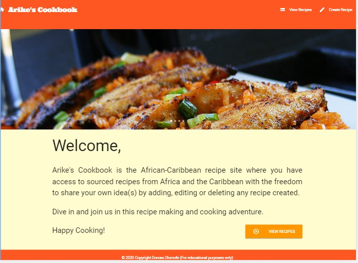

# Welcome to Arike's Cookbook!

## [Visit Site](https://ms3-project-arikescookbook.herokuapp.com/)

The idea of creating this project was birthed from my passion for cooking. I have always had the desire and vision to publish a cookbook someday, so when the opportunity for this project came along, I thought this is a great opportunity to make my long awaited dream happen. I have chosen the African-Caribbean theme as I believe it will help many from these groups to overcome the day-to-day challenge of what to prepare for the family due to some known limitations in food varieties.

Given that the World has become a global village through the internet, I strongly believe having a pool of recipes that could be easily accessed online will help many wives, mothers, husbands, fathers, young or old and many more to combat the above mentioned challenge. Besides this, it will also help many people from all walks of life, races, ethnic groups, backgrounds e.t.c who may want to explore cooking dishes from Africa or the Caribbean. 

I believe, Arike's cookbook will become and is the place to visit in this regard cause we are passionate about good food. :smile:

Thank you and enjoy the ride. :rocket:

## UX

This project was created to meet the needs of a vast majority of people. Below are a few _User Stories_:

* 'As a potential user who is looking for some Afro-Caribbean recipes, on visiting your site, I want to be able to view some simple and easy to make recipes with the freedom to possibly create and share my own idea.'

* 'As a wife/mother who wants to create a food timetable, I need a list of African or Caribbean recipes that will help me to easily achieve this'

* 'As a cookery tutor, I need some recipes to help teach my class a new dish from some specific continents and I will also require them to be able to come up with their own ideas by creating a recipe I can view and edit online.'

* 'As a developer, I want to meet the above needs by creating a cookbook site to help a wide range of people who will be able to create, read, update or delete any recipe from the site.'

In order to meet the requirements of the users, I began to brainstorm on what to do and how to go about it so as to deliver the desired result. I then visited similar sites online and those created by other code institute students which helped me to make an informed decision. After which I began creating the wireframe designs of my proposed website on Balsamiq [please see file attached under uxdesign folder located in the static folder](https://github.com/Dorcas-Amoo/ms3-project-arikescookbook). This helped me to really put a deeper thought into the idea, the layout, colour-scheme and many more and I am pleased with the result so far. Please note, the final product may not be an exact replica of the wireframes. Thank you.

## Features
1. **Home Page:** This contains the following:
  + The Navbar which displays the Logo (links to the homepage on click) and the "View Recipes" and "Create Recipes" pages.
  + The Carousel (Image Slider).
  + The Welcome message.
  + The Navigation button to access Recipes page.
  + The Footer which displays the copyright content.
2. **The Recipes Page:** This contains the following:
  + The Navbar which displays the Logo (links to the homepage on click) and the "View Recipes" and "Create Recipes" pages.
  + The Carousel (Image Slider).
  + The page header ("Recipes").
  + The search feature (Which displays existing recipes when certain related words are entered in the search bar).
  + The Navigation button to access Create Recipe page.
  + The collapsible accordion (Displays all created recipes and on click, reveals the description. Details are generated from the database).
  + The "Read More" button on the accordion (Serves a link to view the "Recipe Info" page).
  + The Footer which displays the copyright content
3. **The Recipes Info Page:** This contains the following:
  + The Navbar which displays the Logo (links to the homepage on click) and the "View Recipes" and "Create Recipes" pages.
  + The Carousel (Image Slider).
  + The page header (The Recipe_Name generated from the database).
  + The icons and other recipe details section (Details generated from the database).
  + The Ingredients and Instructions section (Details generated from the database).
  + The Navigation buttons to access Edit Recipe page or to return to Recipes page.
  + The Footer which displays the copyright content
4. **The Create Recipe Page:** This contains the following:
  + The Navbar which displays the Logo (links to the homepage on click) and the "View Recipes" and "Create Recipes" pages.
  + The Carousel (Image Slider).
  + The page header.
  + An empty Recipe Form which contains the following:
     + Category Name (A dropdown list generated from the database)
     + Recipe Name
     + Description
     + Cuisine (A dropdown list generated from the database)
     + Ingredients
     + Instructions
     + Cooking time
     + Servings
     + Created By
     + Date Created (Features a datepicker powered by a script from Materialize)
  + The buttons to "Create" a recipe or "Close" the form and return to Recipes page.
  + The Footer which displays the copyright content
5. **The Edit Recipe Page:** This contains the following:
  + The Navbar which displays the Logo (links to the homepage on click) and the "View Recipes" and "Create Recipes" pages.
  + The Carousel (Image Slider).
  + The page header.
  + A pre-filled Recipe Form which contains the following that are editable information generated from the database:
     + Category Name (With dropdown option)
     + Recipe Name
     + Description
     + Cuisine type (With dropdown option)
     + A list of Ingredients
     + Instructions
     + Cooking time
     + Servings
     + Created By
     + Date Created (Features a datepicker powered by a script from Materialize)
  + The buttons to "Update" the edited recipe, "Delete" the recipe from the database, or "Close" the form and return to Recipes page.
  + The Footer which displays the copyright content
6. **The Error Page:** This feature was added as a last resort so was not included in the wireframe but it is to ensure users are able to get back to the right page in the case of any error on visiting the site especially if the wrong url is being entered in the browser.

NOTES: The Create and Edit forms feature multiple validations to prompt users to complete an input field or to insert a required format.
       The Navbar on mobile view changes to a sideNav (Burger bar) where the pages link can be accessed.

### Features to be Implemented

In order to expand the features of the site, I would like to implement the following in the future:

   I) A login and authentication page with personalised greeting.
   II) Most importantly a BACKEND VALIDATION which will help to provide additional security to the data on the site.
   III) A dashboard for additional records of the number of recipes available on the site.
   IV) A pagination to help reduce the lenght of the recipe page for better user experience.
   V) Allow users to add more cuisine type to the site so as to expand the scope.
   VI) A page where users on login can view, manipulate and manage their own recipes.
   VII) A flash message popping up when a user want to perform the delete function.
   VIII) A modal message to inform the user that an action carried out had been successful or not.
   IX) A product page to expand the scope of the site.
   X) A user feedback, comments and testimonials feature.
   

## Technologies Used
The following technologies were used to achieve the requirements of this project:

+ [Heroku](https://www.heroku.com/)
  + This was used to host my website
+ [Github](https://github.com/)
  + This was used as the project repository. 
+ [Gitpod](https://www.gitpod.io/) 
  + This was used to develop the site and [Git](https://git-scm.com/) for version control.
+ [CSS3](https://en.wikipedia.org/wiki/Cascading_Style_Sheets)
  + CSS3 was used to custom sytle my website to my desired outcome.
+ [HTML5](https://en.wikipedia.org/wiki/HTML5)
  + HTML5 was used as the markup language to structure and present my website on the Web.
+ [Javascript](https://www.javascript.com/)
  + This was used to achieve the interactive part of the site.
+ [JQuery](https://www.jquery.com/)
  + These scripts from the Materialize were used to initialise some features on my site.
+ [Python](https://www.python.org/)
  + I used this as the backend language to help manipulate data.
+ [Flask](https://palletsprojects.com/p/flask/)
  + The web framework written in python used for building my application.
+ [Jinja](https://pypi.org/project/Jinja2/)
  + This serves as the templating language used with flask.
+ [MongoDB](https://www.mongodb.com/cloud/atlas)
  + This was used to host my stored database. Serves as a repository for my database.
+ [Pymongo](https://pymongo.readthedocs.io/en/stable/)
  + This serves as the communication link between my application and the mongoDB database.
+ [Materialize](http://archives.materializecss.com/0.100.2/)
  + This frontend framework was used to build the site and then customised to my desired outcome.
+ [Material Icons](https://material.io/resources/icons/?style=baseline)
  + Icons used throughout the site were generated from here.

## Testing
Over the course of building this project, I encountered a few challenging **bugs** which I was able to **fix** by asking relevant questions from the Tutors, my Mentor and carrying out extensive research. This made it paramount for me to adopt the *defensive* approach and habitually carry out testings as I build the site (I made use of the **developer tool**) so as to ensure things work properly, and in addition to this, I carried out the following:

+ **Responsiveness Testing**
1. During construction, I regularly test the site against its *Responsiveness* by clicking on **Inspect** to view the *developer tool*.
2. I then checked the layout by clicking on the **Ipad, the Iphone and selected other devices to view**.
3. I also adjusted the pane to view the point at which the design changes to a mobile, tablet, laptop or desktop view.
4. This process helped me to add the media queries section, in order to achieve my desired outcome.

+ **Page Testing**
I carried out the following tests on these devices (Mobile, tablet, laptop):
   + Once the site loads, all contents were displayed as expected.
   + I clicked on all links in the Navigation and side bars which opens the required page successfully.
   + I click on all buttons which acted as expected.
   + I clicked on the search section and was able to enter words and successfully displayed the expected results. Howevever, I noticed an error where some unexpected data were being displayed.
   + I clicked on the accordion which worked and displayed the relevant information as expected.
   + The "read more" button took me to the correct page.
   + All icons behave as expected.
   + All forms stored and displays data as expected.
   + Form input validations works as expected.
   + The datepicker works correctly even though a bug was encountered but resolved.
   + The dropdown options work correctly.
   + The create button on click, stores the entered data in the database and the data is displayed in the Recipes list as expected.
   + The update button, successfully changes the data in the database.
   + The close button takes you to the expected pages.
   + The delete button works successfully as data was being removed from the database on click.
   + Error page worked as expected, the return button takes you back to the Homepage successfully.
   + Although the image layout was initially faulty but this was fixed and the carousel scrolls as expected.
   + The copyright displays correctly on all pages.

+ **UX Testing**
  + To validate the user experience, I asked a number of my friends and family members to help. They were asked to use the site so as to help give an unbias and accurate feedback.
 
   1. They were to try using all the links to test its functionality and usability.
 
   2. They all came back with different feedbacks as follows:
     + "Whao Whao, beautiful, a job well done!"
     + "I like the pictures and colour-scheme!"
     + "The site was vey easy to use"
     + "It opens fast and very clean"
     + "The images are not even" (Although, I had noticed this myself, this being pointed out made me go all the way to resolve this)
     + "I was able to submit a recipe" (This came through to my list of data in my database)
     + "I edited a recipe" (I confirmed this from my database)
     + "I deleted a test recipe" (I confirmed this from my database)
     
 + **Other Testings**
  + For my **HTML5 code testing**, I used [The W3C Markup Validation Service](https://validator.w3.org/)
  + For my **CSS3 code testing**, I used [The W3C CSS Validation Service - Jigsaw](https://jigsaw.w3.org/css-validator/)
  + For my **Javascript and JQuery code testing**, I used [JSHint](https://jshint.com/)
  + For my **Python code testing**, I used [PEP8](http://pep8online.com/)
  + For **Browsers testing**, I did not have any issues opening or viewing the site on the different browsers that was used namely: **Microsoft Edge**, **Mozilla Firefox**, **Google Chrome**, **Safari** and other different mobile browsers, namely, **Android** and **iOS.** On all of these platforms, I had a smooth user-friendly experience.

## Bugs

I encountered a number of bugs in the process which I was able to overcome the majority of them.

+ The Search section: Upon carrying out a search, I noticed no results were being displayed and after asking my mentor, he helped me to see where I have made a mistake in my written app.py code and this was resolved. However, I find that some unexpected data were being displayed when I type in "Rice Dish", it brings out all the rice dishes and some others that are not. I am yet to get this resolved.
+ The datepicker was not being initialize due to a known bug from Materialize, the Code Institute Task Manager tutorial helped to resolve this.
+ The Carousel images were noticed to be uneven on mobile view, and the images were resized to solve this.
+ The "Read More" buttons displays read at a point in mobile view. Although I tried to fix this, I am yet to solve this.
+ The dropdown menu were not being displayed correctly on Edit Recipe page which made data entered in the "Cuisine" section to be displayed as "None". I was able to resolved this through guidance from the Tutor support as they helped me to see a spelling mistake which I corrected.

## Deployment

To deploy my site, I made use of the Heroku hosting platform following this process:

1. Created a new app in Heroku
2. In the settings tab, the following environment variables configuration were set in place:
  - MONGO_DBNAME = "Your MongoDB collection name"
  - MONGO_URI = mongodb+srv://<username>:<password>@<clustername>-y3iip.mongodb.net/<dbname>?retryWrites=true&w=majority
  - SECRET_KEY = "My secret key"
  - IP = `5000`
  - PORT = `0.0.0.0`
3. From the heroku dashboard of my application, I clicked on "Deploy" > "Deployment method" and selected GitHub.
4. I connected to my GitHub repository.
5. I then set the project up for automatic deployment which helped to deploy easily whenever the master branch is updated through pushing to Github.
6. To do this manually, in the deployment section, select the master branch and click 'Deploy Branch".
7. The site should then be successfully deployed.
  
To run code **locally**:
1. From [GitHub](https://github.com/), click on the "Clone" button.
2. Choose "Download Zip" (The download starts).
3. After the download is complete, open the zip folder by double clicking to access created page.
4. The page will launch on your chosen browser.
NOTE: Ensure that you have MondoDB downloaded on your device else this will not work. Also, install the following:
  + `pip install -r requirements.txt`.
  + For any newly added packages to the project, use `pip freeze --local > requirements.txt ` this will update the requirements.txt file with new dependencies.
  + Also ensure that a Procfile is installed for it to run on Heroku.
  

## Credits & References
From my research, the following made an impact in the successful completion of this project as it had been challenging yet enjoyable. I have also learnt a lot from completing the project. Please kindly see links below. Thank you.

### Content
+ [The Font by Google Fonts' Ultra](https://fonts.google.com/specimen/Ultra?query=ultra)
+ [Custom Styling](https://css-tricks.com/)
+ [Markdown-Cheatsheet](https://github.com/adam-p/markdown-here/wiki/Markdown-Cheatsheet#lines)

+ **Tutorials and Other useful resources**
  + [Code Institute for HTML, CSS, JavaScript & UX](https://courses.codeinstitute.net/program/FullstackWebDeveloper)
  + [Foodology](https://github.com/lewisclark4/CI-MilestoneProjectThree)
  + [Recipebook](https://github.com/sohailshams/cookbook)
  + [BYOBoba](https://github.com/amybru/byoboba)
  + [Carousel Styling](https://www.youtube.com/watch?v=Mh3SV0iCNxw)

### Media
The images and recipes used, and my *Wireframes* were from the following:
+ [Balsamiq](https://balsamiq.com/)
+ [The meatpie](https://cheflolaskitchen.com/west-african-meat-pie/)
+ [The Jollof image](https://i.pinimg.com/originals/10/ef/46/10ef46e6db7545c35630ac4a5fb063d0.jpg)
+ [The Assorted](https://duyt4h9nfnj50.cloudfront.net/resized/1526866690836-w2880-ab.jpg)
+ [The food](https://media.istockphoto.com/photos/jollof-rice-with-chicken-and-plantains-picture-id688602226?k=6&m=688602226&s=612x612&w=0&h=Z3uutBWu7u1qVSJfupyPpffqXIOf6TQGo2z8ddEwNhw=)

### Acknowledgements
I got inspiration for my project from the following:
+ [Code Institute](https://courses.codeinstitute.net/program/FullstackWebDeveloper)

Many thanks to my Mentor **Dick Vlaanderen** for his guidance despite the challenge of time difference. Also to my family and friends who helped to test the usability and functionality of the project and gave valuable feedbacks to assist in improving the site.

Also a huge THANK YOU to the Code Institute Team! (Tutors and All).

--------

Thank you for visiting! :smile:
